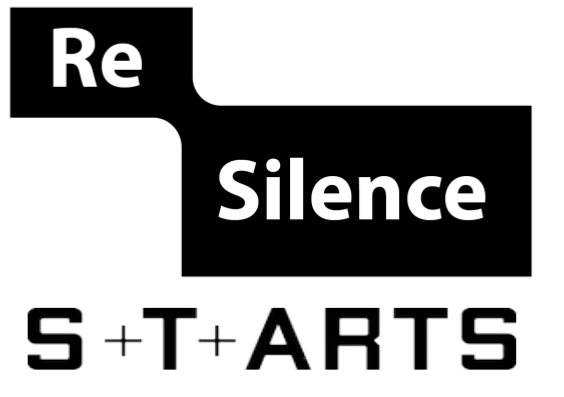

---

title: PyEyesWeb

---

# PyEyesWeb  
Movement Analysis Toolkit

:material-rocket-launch: **Extract features** from raw human movement data  
:material-school: **Apply in science, health, and the arts**  
:material-handshake: **Developed within the [Resilence EU Project](https://resilence.eu/)**

[:octicons-book-24: Get Started](getting-started.md){ .md-button .md-button--primary } [:material-github: GitHub Repository](https://github.com/InfoMusCP/InfoMove){ .md-button }  

---

## 🌍 Why PyEyesWeb?

PyEyesWeb builds on the **Expressive Gesture Analysis** methods of EyesWeb, 
bringing qualitative movement analysis into **Python** as a core aim of the project,
creating a modern, modular, and accessible toolkit for research, health, and artistic applications.  

PyEyesWeb is designed to facilitate adoption in **artificial intelligence and machine learning pipelines**,
while also enabling seamless integration with **creative and interactive platforms**
such as **TouchDesigner, Unity, Unreal Engine, and Max/MSP**, supporting innovative,
cross-disciplinary projects at the intersection of science and the arts.

Learn more about EyesWeb

<a href="https://casapaganini.unige.it/eyesweb_bp" target="_blank">EyesWeb</a> is an open software research platform for the design and development of <b>real-time multimodal systems and interfaces</b>.  
It supports a wide variety of inputs, including motion capture, cameras, game controllers (Kinect, Wii), multichannel audio, and physiological signals.  
  
Outputs include multichannel audio, video, analog devices, and robotic platforms. EyesWeb provides libraries such as <b>Non-Verbal Expressive Gesture Analysis</b> and <b>Non-Verbal Social Signals Analysis</b>, and a visual programming environment that enables users to develop <b>real-time, networked applications</b>.  
  
Originally started in 1997, EyesWeb has been adopted worldwide in scientific research, education, and industry, including EU projects and collaborations with organizations such as INTEL and NYU.  

---

## 🧩 Use Cases  

  

- :material-school:{ .lg .middle } **Research & Science**  
  ---  
  Quantify motor control, study learning, and analyze biomechanics with validated methods.  

[//]: # (  [:octicons-arrow-right-24: Learn more]&#40;applications/research.md&#41;  )

- :material-theater:{ .lg .middle } **Artistic Performance**  
  ---  
  Explore synchrony, coordination, and expressive qualities in dance and live performance.  

[//]: # (  [:octicons-arrow-right-24: Learn more]&#40;applications/artistic.md&#41;  )

- :material-hospital:{ .lg .middle } **Health & Rehabilitation**  
  ---  
  Assess movement disorders, monitor recovery, and support clinical studies.  

[//]: # (  [:octicons-arrow-right-24: Learn more]&#40;applications/health.md&#41;  )

- :material-connection:{ .lg .middle } **Interactive Media**  
  ---  
  Integrate PyEyesWeb in real-time with [TouchDesigner](extensions/touchdesigner.md).  

  

---

## 🔬 Methodological Foundation  

PyEyesWeb builds on:  

- Motor control & biomechanics research  
- Signal processing & multivariate statistics  
- Computational geometry  

It is designed as a **modular framework**, bridging **low-level kinematic features** with **high-level coordination patterns**.  

---

## 🤝 Project Context  

PyEyesWeb is developed as part of the **[Resilence EU Project](https://www.resilence.eu/)**,  
funded by the European Union’s Horizon programme.  

  
!!! info "About the Authors"
    PyEyesWeb is developed by [**InfoMus Lab – Casa Paganini**](http://www.casapaganini.org/index_eng.php){:target="_blank"}, University of Genoa, as partners of the Resilence EU Project.  
    
    

    { width=512 }
    

---

## 📖 Explore the Documentation  

- 🚀 [Getting Started](getting-started.md) – install, examples, and feature list  
- 🧮 [Core Modules](modules/index.md)  
- 🎓 [Applications](applications/index.md)  
- 🎭 [TouchDesigner Extension](extensions/touchdesigner.md)  

---

MIT Licensed · Open for collaboration  
